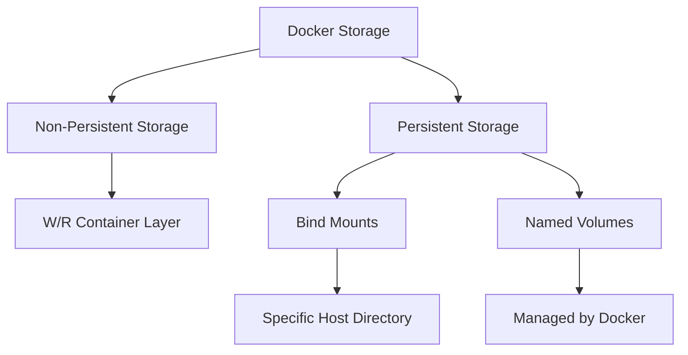

# Introduction

# So what's docker

**Docker** is a software platform developed by Docker, Inc. that implements the concept of containers, allowing developers to package applications and their dependencies into containers. 

- **Docker software** can be installed on **Linux, Windows, and macOS**, enabling the creation of containers. However, Docker primarily creates **Linux** and **Windows containers**.
    
- On **Windows**, Docker can run both Windows and Linux containers. To run Linux containers on Windows, Docker uses a lightweight **Linux virtual machine (VM)** as a host environment where Linux containers can run.
    
- On **macOS**, Docker also uses a **Linux VM** to run Linux containers, as macOS doesn't natively support running Linux containers directly on the host.


## Getting Started 🚀
use [play with docker](https://labs.play-with-docker.com) to start experimenting.
1. create an account in the [official docker website](https://app.docker.com/) and then add an instance


```docker
# to list all containers
docker container ls -a 

# to run container alpine in it's latest version in interactive mode
- `-i` (interactive): 
Keeps the STDIN open, allowing you to interact with the container.
- `-t` (TTY):
Allocates a pseudo-terminal, which makes it behave like a terminal interface.

docker container run -it alpine:latest sh

# to exist container 
exit

# to run a container in the background 
docker container run -d -p 80:80 nginx:latest

# to stop container
docker container stop <container_id>

# to list images
docker images ls

# to view version and info
docker version
docker info
```
_________________
# Installing docker software 
this is a shell script made by `docker` to do the installation and check the linux version for you
```shell
curl -fsSL https://get.docker.com -o get-docker.sh
sudo sh ./get-docker.sh --dry-run
```


it will work only with privileged users 


unprivileged user


to solve it 
``` shell
# we have to add to the non priviledge user, docker group
usermod --append -G docker reema
groups
```


____________
# Docker follows a client/server architecture
## 1. Client is the `CLI` interface that issues commands to the docker server. 
## 2. Server is the docker daemon; one that listens to the commands and creates,runs and stop container.
_______________
## Registry is the images storage.
_________


________

# Container = Application

- In a container, the **application is the main process** (typically running as **PID 1**). If this process exits, the entire container is terminated.
    
- You can open additional processes from the main process, but when they are terminated, control returns to the original application (PID 1).
    
- you cannot separately manage or interact with individual layers of the container. The container itself represents one cohesive unit of execution.
    
- The command that runs the application within the container can be changed, allowing flexibility in how the container operates.

``` bash
#change the application
docker container run -it python /bin/bash
```


_______


## Docker Image Layers

- **Layering and Reusability**: Docker images are made up of multiple layers, where each layer represents a change or addition (e.g., installing software, copying files). These layers are read-only and stacked on top of each other to form the final image.
    
- **Layer Reuse**: Docker optimizes storage by reusing layers across different images. If two images share the same base layers (for example, Ubuntu), Docker only stores those layers once. When you build or pull a new image that uses a common layer, Docker doesn’t download it again. This makes Docker highly efficient in terms of storage and speed.
    
- **Merging Layers**: If you merge layers into a single one, you lose the ability to reuse them in other images. For example, if you flatten an Ubuntu image into a single layer, Docker cannot identify and reuse that layer in other images that may depend on it. This leads to increased storage and network overhead, as Docker would need to fetch the full image each time.

- For instance, if you have a Fedora image , an Ubuntu image and a Python image that requires the operating system specifics of Ubuntu, Docker can reuse the existing Ubuntu image layers. However, if the Ubuntu layers were merged, Docker wouldn't be able to reuse them, leading to unnecessary downloads and increased storage usage.
- 


______________

# Image Deep Dive
- An image is a read only container 
- Consists of layers stacked on top of each other
- it's a package of everything needed for an application to run
- An image is the template and the running instance is the container
- Images are considered _build-time_ constructs where containers are _runtime_ constructs


- get image by `docker image pull` from registry, by default docker hub is used.
- images are usually small,Images have _just enough operating system_
## Image naming
- images are stored in `registries` like [docker hub](https://hub.docker.com/)
- Image registries contain one or more _image repositories_. Each repo can have one or more versions of the image.


### Official and unofficial repositories

- **_Official repositories_** are the home to images that have been vetted and curated by Docker, Inc.
- **_Unofficial repositories_** may not be safe, well-documented or built according to best practices.


```bash
# here im pulling the latest version of python image
$ docker image pull python:latest

#  here im pulling the 2.3.4 version/tag of python image
$ docker image pull python:2.3.4

# here im pulling an unofficial image from a docker hub account called sami
$ docker image pull asami76/hadoop:v1.0
```
### Images and layers
- Each layer is one or more files


- docker download then extract then pull the layer
- every layer will have it's own id
- Another way to see the layers of an image is to use `docker image inspect <image-name>`


#### Example : 
Create a Python application on top over Ubuntu 20.04 then some source code is added


### Sharing image layers
Multiple images can, and do, share layers. This leads to efficiencies in space and performance.


### How does docker know platform/arch of client?
- When pulling an image, the Docker client interacts with the Docker Registry API provided by Docker Hub through the command-line interface.
- The API inspects the platform and architecture of the calling Docker client.
- If the image has a manifest list, it will be parsed to check if there's a specific manifest that matches the client’s platform.
- If a matching manifest is found, the API retrieves and serves the corresponding image layers for that platform.


___________
# Container deep drive
- it's a runtime of an image.
- A single Docker image can be used to start multiple Docker containers.


- `docker container run <image> <app>`
- `$ docker container run -it ubuntu /bin/bash`
- `$ docker container run -it alpine:latest sleep 10`

To stop the container:  
`docker container stop`

To start the container:  
`docker container start`

To delete a container forever:  
`docker container rm`
____________

# Networking
there's many ways to make `host` interact with container
1. by using the switch `-it` to make the container interactive and connect it to a pseudo terminal.
   
        > - **`-i` (interactive mode)**: Keeps the standard input open (means the container will wait and accepts an input from the user, interact with the container's processes real-time and provide data) allowing you to interact with the container.
        > - **`-t` (pseudo-TTY)**: Allocates a pseudo-terminal, which makes the container’s environment behave more like a terminal.
        
2. by using `cp` copy command
   
        > `docker container cp <file_name> <container_name>:<file_path>`
        > `docker container  cp ./file.py fafa:/tmp/file.py`


3. by port mapping
   
        > Port mapping in Docker allows you to expose a container's internal port to the host machine `-p <host_port>:<container_port>`; enabling access to services running inside the container from outside.
        > `docker run -p 8080:80 <image_name>`
        > This maps port 80 inside the container (typically used for web servers) to port 8080 on the host. Now, you can access the service (like a web app) running inside the container by visiting `http://localhost:8080` on your host machine.
   


## Docker provides networking capabilities that allow containers to communicate with each other
- if you ping one container from another and it succeeds because by default, containers in the same **Docker network** can communicate with each other.


- if i added `--add-host <container_name>:<ip_address>` to the other container then i can ping using the container's name as well

cause you will fine in the `etc/hosts`


 this is the temporary solution
 ________

# Docker networking
By default, Docker provides three types of networks when you install it. These networks control how containers communicate with each other, the host, and the outside world.


## By default, there are three networks
- **Bridge**
     - This is the default network that Docker containers are attached to when no specific network is specified. Each container gets its own isolated IP address within this network.
     - Containers on the same bridge network can communicate with each other using IP addresses.
     - External access to a container’s services requires **port mapping** (e.g., `-p 8080:80`), which links a port on the host to a port on the container.
 


- **Host**
    - The container shares the host’s network stack. This means that the container doesn’t get its own IP address, and it uses the host’s network interface directly.
    - There is no network isolation between the container and the host. The container can access all network interfaces on the host.
    - No port mapping is needed; services running in the container can be accessed directly via the host’s IP address


- **None**
    - This is an isolated network mode where the container has no network interface.


_________

## Network Driver 
- bridge
- macvlan
- overlay
___________
## We can create networks using these network drivers
```bash
# creating a network with the default driver (bridge)
docker network create mynet 
# with subnet
docker network --subnet 10.0.0.0/16 mynet2
# connecting to an running container
docker network connect mynet alp1
# to disconnect
docker network disconnect mynet alp1
```
for connecting more than one network


The **number of network interfaces** a Docker container has depends on the number of **networks** it is connected to


for disconnecting


#### using `internal` switch
creating an **internal network** where containers can communicate with each other but cannot be accessed from outside the network(cannot send or receive traffic from outside the network).
`docker network create --internal <network_name>`


_________

# Container Storage



## Non-persistent Storage 
- Containers are designed to be isolated and immutable(rigid/unfixed).
- Every Docker container is created by adding a thin read-write layer on top of the read-only image it’s based on.
- The writeable layer is called many names: _local storage_, _ephemeral storage_, and _graphdriver storage_. 
- it’s typically located on the Docker host in these locations:
   -  Linux Docker hosts: `/var/lib/docker/<storage-driver>/...
- The storage's life-cycle = container's life-cycle.

  


## Persistent Storage and volumes
- Volumes are the recommended way to persist data in containers.
- Volumes are independent objects that are not tied to the life-cycle of a container.
- Volumes can be mapped to specialized external storage systems.
- Volumes enable multiple containers on different Docker hosts to access and share the same data.
### 1. Bind Mounting
- mounting on the container a directory from the docker host.
- any changes made in that directory will be reflected on both the host and in the container.
```bash
docker container run -it -v <path_directory_host>:<container_directory> centos:latest
```


### 2. Named Volumes
1. Create a volume
2. Create a container
3. The volume is mounted into a directory in the container’s filesystem
4. Anything written to that directory is stored in the volume
5. If you delete the container, the volume and its data will still exist.
```bash
docker volume create myvol
docker container run -it -v myvol:/app/code python:latest bash
```


__________
# Containerization of Application 
## 1. Building an image from a container 
```python 
# application
from flask import Flask


app = Flask(__name__)

@app.route('/')

def hello_world():

return 'Hello, World!'

  
if __name__ == '__main__':

# Set host and port along with debug=False

app.run(host='0.0.0.0', port=5000, debug=False)
```
```bash
#choose the base image you want to start with
docker container run -it python:latest bash 

#update and upgrade the debian packages
apt update
apt upgrade

#then install vim to use it as an editor 
apt install vim

#then importing the application requirements
pip install flask

#then commiting the changes i made to the container to be an image
docker commit <container_name> <docker_hub_account/image_name:tag>
docker commit priceless_pasteur reema828/fflaask:v1.0
#then you can use this image to run a container
docker container run -it -p 5050:5000 --name ppyf  reema828/fflaask:v1.0  python ./hello.py
```


### BUT ! 
- This method is not the optimal way because each time you want to make changes, you have to run the container then commit these changes to apply the changes and a have a new image .
- All changes done is a one layer, the container r/w layer.

## 2. Using Dockerfile
A Dockerfile: it's an instruction file that tells the docker engine what to do.
```dockerfile

# Pull the latest Python image
FROM python:latest

# Set the working directory inside the container
WORKDIR /app

# Copy the requirements file from the build context (host machine) to the container
COPY requirements.txt .

# Install the required Python packages inside the container
RUN pip install -r requirements.txt

# Copy the Python script from the build context to the container
COPY file.py .
#######################
# these commands are in the metadata of the image 
# Expose port 5000 (commonly used by Flask and other web apps) of container
EXPOSE 5000

# Specify the command to run your Python script when the container starts
CMD python file.py
```
> Key Concepts:
> 
> 1. **Base Image**: `FROM python:latest` pulls the latest Python image from Docker Hub.
> 2. **Working Directory**: `WORKDIR /app` ensures the container has a dedicated directory for your app. If `/app` doesn’t exist, Docker creates it.
> 3. **Copying Files**:
>     - `COPY requirements.txt .` copies the `requirements.txt` file into the container.
>     - `COPY file.py .` copies your Python file into the container.
> 4. **Install Dependencies**: `RUN pip install -r requirements.txt` installs the Python dependencies listed in the `requirements.txt` file.
> 5. **Port Exposure**: `EXPOSE 5000` makes port 5000 available to connect to the app.
> 6. **Command**: `CMD python file.py` defines what command will be run when the container is started.

### How to Use the Dockerfile:

1. **Build the Image**: From the directory where your Dockerfile and Python files are located, run:
```bash
docker build -t <dockerhub/imagename:tag> <directory_of_build_context>
```
### In conclusion 


____________

## Difference between two methods

| Feature                    | Dockerfile Method                                                | Commit Method                                           |
| -------------------------- | ---------------------------------------------------------------- | ------------------------------------------------------- |
| **Layer Granularity**      | Each Dockerfile instruction creates a clear, fine-grained layer. | Each commit creates one large layer with all changes.   |
| **Efficiency**             | Layers are cached, making future builds faster and smaller.      | No caching; every commit creates a new, large layer.    |
| **Repeatability**          | The image can be rebuilt consistently from the Dockerfile.       | Hard to reproduce unless you remember every change.     |
| **Control**                | Full control over what each layer contains.                      | Less control; changes bundled into a single snapshot.   |
| **Transparency/Debugging** | Clear and structured; easy to debug and track changes.           | Opaque; hard to see what changes went into which layer. |
___________________
# Dockerfile in Detail
```dockerfile
#FROM

#this base image will pull the latest version by default

FROM python

#this base image with tag and it's an offical image

FROM ubuntu:18.4

#this base image is an unoffical

FROM reema828/pyflask:v1.0

#this base image by it's digest (it's more accurate if changes to this layer happen)

FROM python@sha256:97fc9ec41404bf3b8395f559c4fa381e20fa303f1fb56877c073f9af9e05507f

#this base image is not the default registry

FROM mcr.microsoft.com/mssql/server:2019-latest

  

#######

#WORKDIR

#this does mkdir(if it doesn't exit) then cd

WORKDIR /app

#if i didn't give the absolute path in one line so i can do this, the working directory will be /app/subdir

WORKDIR subdir

  

#######

#COPY

#copy command will always copy from "build context"

COPY file.py /app/file.py

#coping multiple files at once

COPY file.py /code/file1.py /app/

#coping everything in the directory

COPY . /app/

#coping a file with spaces

COPY ["name with spaces", "/app/"]

  

#######

#ADD

#copy files that does not exist in the build context, either downloading or an archieve

ADD <URL> /app/

ADD <ARCHIEVE> /app/

  

#######

#SHELL

#the default shell is sh to change it use SHELL

SHELL [ "/bin/bash" , "-c" ]

#it can be python

SHELL [ "/usr/local/bin/python","-c" ]

  

######

#RUN

#run in the buildtime

#run command must be a one liner, it will not expect an input

RUN <command> <arg1> <arg2>

#OR

RUN ["command", "arg1" , "arg2"]

RUN echo "this is a line" > /tmp/file

RUN echo "this is another line" >> /tmp/file

RUN cat /tmp/file

RUN find / -name "python"

RUN pip install flask

RUN apt update && apt update -y

  
  

######

#metadata after build time

#ENV

ENV <key> <value>

ENV SQL_SA_ACCOUNT "SA"

ENV SQL_SA_ACCOUNT=SA SQL_SA_PASSWORD="pass"

ENV PATH $PATH:/app

ENV PATH="usr/loca/hadoop/bin:${PATH}"

ENV EMPTY ""

  

#######

#USER to change from the root user

RUN groupadd newuser && useradd -g newuser reema

#this so su -u <user>

USER reema

RUN id

  

######

#ENTRYPOINT

#first command executed

ENTRYPOINT [ "/bin/bash" , "-c" ]

  

#######

#cmd

CMD [ "<args of ENTRYPOINT" ]

  

######

#label will be shown in the inspect of image

LABEL <ANYTHING>=<"value">

  

######

#arg

#these arguments are within the dockerfile only

ARG base_image=python

```
_____________
# Image Registry
```bash
#login into docker account to push image
docker login
#changing the repos name and tag
docker tag <old_repo_name> <new_repo_name>
#to push images to your docker hub account
#docker image push <repo>:tag 
docker image push reema828/fflaask
```


if i re-upload a version that already exists, an optimization happens.


_________


 
 


